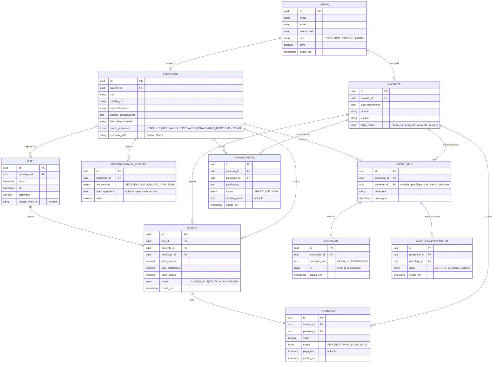

# Diagrama Entidade-Relacionamento — Universo Psicólogo

**Versão:** 1.0  
**Data:** 30/06/2026  
**Referência:** Arquitetura-UniPsi.md — Seção 6 (Modelo de Dados)

---

---

## Legenda de cardinalidades

| Notação | Significado |
|---|---|
| `\|\|--\|\|` | Um para um (obrigatório dos dois lados) |
| `\|\|--o\|` | Um para zero ou um |
| `\|\|--o{` | Um para zero ou muitos |
| `\|\|--\|{` | Um para um ou muitos (obrigatório no lado N) |

---

## Notas do modelo

| Entidade | Observação |
|---|---|
| `USUARIO` | Tabela base para todos os perfis. O campo `role` determina qual tabela de perfil é consultada em seguida. |
| `PSICOLOGO` / `PACIENTE` | Herança por tabela associada — cada entidade tem sua própria tabela com FK para `USUARIO`. |
| `SLOT` | Representa um horário criado pelo psicólogo. Torna-se indisponível ao ser vinculado a uma `SESSAO`. |
| `SESSAO` | Guarda `psicologo_id` além do `slot_id` para facilitar consultas financeiras e de agenda sem join adicional. |
| `PRONTUARIO` | `paciente_id` é nullable — o psicólogo pode optar por não vincular o cadastro da plataforma, usando apenas o codinome. |
| `ANOTACAO` | `conteudo_enc` nunca trafega em texto claro fora do `CriptografiaService`. O `iv` é único por anotação. |
| `AUDITORIA_PRONTUARIO` | Registra todo acesso ao prontuário (leitura, escrita, edição) para conformidade com CFP e LGPD. |
| `REVISAO_PERFIL` | Iniciada pelo psicólogo, decidida pelo admin. Não bloqueia atendimentos em curso. |
| `COBRANCA` | Gerada automaticamente ao marcar uma `SESSAO` como `REALIZADA`. Fluxo de pagamento simulado no MVP. |
