```mermaid
erDiagram

    USUARIO {
        uuid    id          PK
        string  nome
        string  email
        string  senha_hash
        enum    role        "PSICOLOGO | PACIENTE | ADMIN"
        boolean ativo
        timestamp criado_em
    }

    PSICOLOGO {
        uuid    id                  PK
        uuid    usuario_id          FK
        string  crp
        string  estado_crp
        array   especializacoes
        array   areas_atuacao       "NOVO 07/07/2026 - tags de temas atendidos, ex. ansiedade/luto/casal (RF-42)"
        text    politica_cancelamento
        string  link_videochamada
        enum    status_aprovacao    "PENDENTE | APROVADO | REPROVADO | AGUARDANDO_COMPLEMENTACAO"
        string  curriculo_path      "path no MinIO"
    }

    PACIENTE {
        uuid    id                    PK
        uuid    usuario_id            FK
        date    data_nascimento       "ainda não implementado - necessário p/ idade (RF-37)"
        string  cidade
        string  estado
        enum    faixa_renda           "FAIXA_1 | FAIXA_2 | FAIXA_3 | FAIXA_4 - definida 1x no cadastro, não editável pelo paciente (RF-06)"
        string  foto_url              "NOVO 07/07/2026 - path no MinIO (RF-36)"
        string  nome_responsavel      "NOVO 07/07/2026 - nullable no banco; UI só exibe/pede se paciente for menor (RF-37)"
        string  contato_responsavel   "NOVO 07/07/2026 - nullable no banco; idem — nunca exibido pra paciente maior de idade"
    }

    ANAMNESE {
        uuid      id            PK
        uuid      paciente_id   FK "1:1"
        text      conteudo_enc  "respostas cifradas (JSON serializado: já fez terapia, motivo, medicação controlada etc.) - AES-256-GCM, mesmo padrão de ANOTACAO (RF-38b)"
        string    iv            "vetor de inicialização, único por anamnese/atualização"
        timestamp criada_em
        timestamp atualizada_em
    }

    AUDITORIA_ANAMNESE {
        uuid      id            PK
        uuid      anamnese_id   FK
        uuid      psicologo_id  FK
        uuid      sessao_id     FK "sessão que originou a janela de acesso"
        timestamp criado_em
    }

    SLOT {
        uuid      id              PK
        uuid      psicologo_id    FK
        timestamp inicio
        timestamp fim
        boolean   disponivel
        string    google_event_id "nullable"
    }

    SESSAO {
        uuid      id              PK
        uuid      slot_id         FK
        uuid      paciente_id     FK
        uuid      psicologo_id    FK
        enum      modalidade      "AVULSA | PACOTE_MENSAL"
        enum      tipo_atendimento "NOVO 07/07/2026 - INDIVIDUAL | CASAL, casal = 2x o valor individual (RF-41)"
        decimal   valor_sessao
        decimal   taxa_plataforma
        decimal   valor_liquido
        enum      status          "AGENDADA | REALIZADA | CANCELADA"
        timestamp cancelado_em    "nullable"
        timestamp criada_em
    }

    MENSAGEM {
        uuid      id                    PK
        uuid      psicologo_id          FK
        uuid      paciente_id           FK
        uuid      remetente_usuario_id  FK "quem enviou - psicólogo ou paciente"
        text      conteudo
        boolean   lida
        timestamp criada_em
    }

    DISPONIBILIDADE_PLANTAO {
        uuid    id               PK
        uuid    psicologo_id     FK
        enum    dia_semana       "SEG | TER | QUA | QUI | SEX | SAB | DOM"
        date    data_especifica  "nullable - para datas avulsas"
        boolean ativo
    }

    PRONTUARIO {
        uuid      id           PK
        uuid      psicologo_id FK
        uuid      paciente_id  FK  "nullable - psicólogo pode usar só codinome"
        string    codinome
        timestamp criado_em
    }

    ANOTACAO {
        uuid      id            PK
        uuid      prontuario_id FK
        text      conteudo_enc  "cifrado com AES-256-GCM"
        bytes     iv            "vetor de inicialização"
        timestamp criada_em
    }

    COBRANCA {
        uuid      id           PK
        uuid      sessao_id    FK
        uuid      paciente_id  FK
        decimal   valor
        enum      status       "PENDENTE | PAGO | CANCELADO"
        timestamp pago_em      "nullable"
        timestamp criada_em
    }

    REVISAO_PERFIL {
        uuid      id             PK
        uuid      paciente_id    FK
        uuid      psicologo_id   FK
        text      justificativa
        enum      status         "ABERTA | DECIDIDA"
        text      decisao_admin  "nullable"
        timestamp criada_em
    }

    AUDITORIA_PRONTUARIO {
        uuid      id            PK
        uuid      prontuario_id FK
        uuid      psicologo_id  FK
        enum      acao          "LEITURA | ESCRITA | EDICAO"
        timestamp criado_em
    }

    %% ─── Herança de usuário ───────────────────────────────────────
    USUARIO     ||--o|    PSICOLOGO             : "tem perfil"
    USUARIO     ||--o|    PACIENTE              : "tem perfil"

    %% ─── Agenda e sessões ─────────────────────────────────────────
    PSICOLOGO   ||--o{    SLOT                  : "disponibiliza"
    SLOT        ||--o|    SESSAO                : "origina"
    PACIENTE    ||--o{    SESSAO                : "agenda"
    PSICOLOGO   ||--o{    SESSAO                : "realiza"

    %% ─── Plantão ──────────────────────────────────────────────────
    PSICOLOGO   ||--o{    DISPONIBILIDADE_PLANTAO : "registra"

    %% ─── Prontuário e anotações ───────────────────────────────────
    PSICOLOGO   ||--o{    PRONTUARIO            : "mantém"
    PACIENTE    ||--o{    PRONTUARIO            : "referenciado em"
    PRONTUARIO  ||--|{    ANOTACAO              : "contém"
    PRONTUARIO  ||--o{    AUDITORIA_PRONTUARIO  : "registra acesso"

    %% ─── Financeiro ───────────────────────────────────────────────
    SESSAO      ||--||    COBRANCA              : "gera"
    PACIENTE    ||--o{    COBRANCA              : "recebe"

    %% ─── Revisão de perfil ────────────────────────────────────────
    PSICOLOGO   ||--o{    REVISAO_PERFIL        : "solicita"
    PACIENTE    ||--o{    REVISAO_PERFIL        : "é avaliado em"

    %% ─── Anamnese (novo 07/07/2026) ──────────────────────────────
    PACIENTE    ||--o|    ANAMNESE              : "preenche"
    ANAMNESE    ||--o{    AUDITORIA_ANAMNESE    : "registra acesso"
    PSICOLOGO   ||--o{    AUDITORIA_ANAMNESE    : "acessa (na janela)"
    SESSAO      ||--o{    AUDITORIA_ANAMNESE    : "origina a janela de acesso"

    %% ─── Mensagens internas (novo 07/07/2026) ────────────────────
    PSICOLOGO   ||--o{    MENSAGEM              : "envia/recebe"
    PACIENTE    ||--o{    MENSAGEM              : "envia/recebe"
```

# Diagrama Entidade-Relacionamento — Universo Psicólogo

**Versão:** 1.1  
**Data:** 30/06/2026 (atualizado em 07/07/2026 — ver `atas/2026-07-07-alinhamento-sprint-4.md`)  
**Referência:** Arquitetura-UniPsi.md — Seção 6 (Modelo de Dados)

---

---

## Legenda de cardinalidades

| Notação | Significado |
|---|---|
| `\|\|--\|\|` | Um para um (obrigatório dos dois lados) |
| `\|\|--o\|` | Um para zero ou um |
| `\|\|--o{` | Um para zero ou muitos |
| `\|\|--\|{` | Um para um ou muitos (obrigatório no lado N) |

---

## Notas do modelo

| Entidade | Observação |
|---|---|
| `USUARIO` | Tabela base para todos os perfis. O campo `role` determina qual tabela de perfil é consultada em seguida. |
| `PSICOLOGO` / `PACIENTE` | Herança por tabela associada — cada entidade tem sua própria tabela com FK para `USUARIO`. |
| `SLOT` | Representa um horário criado pelo psicólogo. Torna-se indisponível ao ser vinculado a uma `SESSAO`. |
| `SESSAO` | Guarda `psicologo_id` além do `slot_id` para facilitar consultas financeiras e de agenda sem join adicional. `modalidade` define se é `AVULSA` (sessão única) ou `PACOTE_MENSAL` (1 das 4 sessões do pacote). `cancelado_em` é preenchido ao cancelar; a decisão de cobrar ou realocar fica no campo de status e no relacionamento com `COBRANCA`. |
| `PRONTUARIO` | `paciente_id` é nullable — o psicólogo pode optar por não vincular o cadastro da plataforma, usando apenas o codinome. |
| `ANOTACAO` | `conteudo_enc` nunca trafega em texto claro fora do `CriptografiaService`. O `iv` é único por anotação. |
| `AUDITORIA_PRONTUARIO` | Registra todo acesso ao prontuário (leitura, escrita, edição) para conformidade com CFP e LGPD. |
| `REVISAO_PERFIL` | Iniciada pelo psicólogo, decidida pelo admin. Não bloqueia atendimentos em curso. **Único fluxo que altera `PACIENTE.faixa_renda` depois do cadastro (07/07/2026).** |
| `COBRANCA` | Gerada automaticamente ao marcar uma `SESSAO` como `REALIZADA`. Fluxo de pagamento simulado no MVP. |
| `ANAMNESE` *(novo 07/07/2026)* | 1:1 com `PACIENTE`, preenchida uma vez (não por sessão/psicólogo) em `/perfil-paciente`. Pertence sempre ao paciente — nunca pública, nunca de acesso permanente ao psicólogo. `conteudo_enc` guarda todas as respostas cifradas como um único blob (JSON), mesmo padrão de `ANOTACAO`; perguntas exatas a definir (tarefa do Victor, ver ata). Se `PACIENTE` for menor de idade (calculado a partir de `data_nascimento`), a regra de negócio exige que a primeira sessão seja com o responsável — campo só exibido nesse caso (`nome_responsavel`/`contato_responsavel` em `PACIENTE`). |
| `AUDITORIA_ANAMNESE` *(novo 07/07/2026)* | Registra cada leitura da anamnese por um psicólogo. **Controle de acesso é computado, não armazenado:** um psicólogo só pode ler a `ANAMNESE` de um paciente se existir uma `SESSAO` entre os dois com `COBRANCA.status = PAGO` **e** `SESSAO.status != REALIZADA` (janela entre pagamento e realização da primeira sessão) — não há coluna de "acesso liberado até"; a checagem é sempre contra o estado atual de `SESSAO`/`COBRANCA`. Fora dessa janela, leitura é bloqueada (mesmo padrão de negação de acesso do prontuário). |
| `MENSAGEM` *(novo 07/07/2026)* | Chat interno entre psicólogo e paciente. Vínculo é pelo par `psicologo_id`+`paciente_id` (não por `sessao_id`), já que a conversa deve persistir por toda a relação, não só por uma sessão. **Regra de negócio (não modelada como FK):** só deve existir/ser permitido enviar mensagem se houver ao menos uma `SESSAO` entre esse par com `COBRANCA.status = PAGO` — validação de aplicação, no service layer. |
